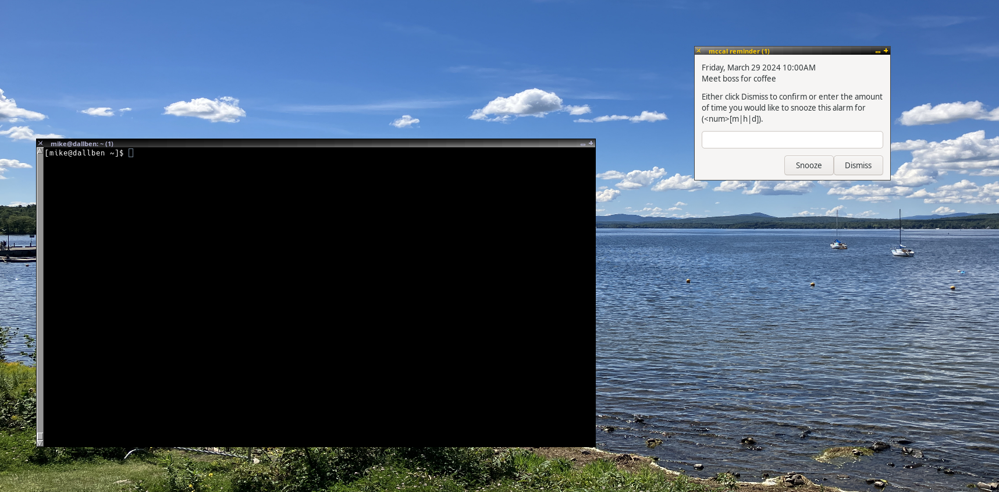

# **mccal**: a simple reminder calendar

<table border="1" style="margin-left: auto; margin-right: auto;">
<tr>
    <td>
    
    </td>
</tr>
</table>

**mccal** is mainly useful for giving you reminders, which
you can snooze, as often as you like, for however many minutes, hours, or
days that you would like. When I originally wrote **mccal** in the mid 2000s,
none of the available calendars for Linux/UNIX had this kind of snoozing
functionality. This is the main reason I wrote **mccal**.

When an appointment becomes due, the program will pop up a window with the
appointment text, which you can then dismiss or snooze as desired. The
program also allows you to optionally send an email in addition to a
popup. **mccal** uses [wxPython](https://wxpython.org/) to implement its
(pretty basic) UI. If you are using [Debian GNU/Linux](https://www.debian.org/)
you may install wxPython by running

    sudo apt install wxpython-tools

## Requirements

- [Python 3](https://docs.python.org/3/index.html)
- [wxPython](https://wxpython.org/) version 4.2.0 (not required when mccal is
  run exclusively in text mode)

## Installation

- Download the source code for the [latest
  alpha
  release](https://github.com/lmcmicu/mccal/releases/tag/v0.2.0-alpha.4) of
  **mccal** and
  copy the folling files to a directory in your executable path (usually
  `~/bin/`):
  - `addappointments`
  - `findappointment`
  - `remind`
  - `viewcal`
  - `getmins`
  - `pause_mccal`
  - `unpause_mccal`
  - `run_findapps.sh`

To start the mccal daemon, you may simply run

    $ findappointment &
    
in a terminal window. Note that it is recommended that you preface this command with
[nohup](https://www.man7.org/linux/man-pages/man1/nohup.1.html) in order to
minimize the risk that the `findappointment` daemon is interrrupted inadvertently.

For command line options run `findappointment --help` (see also below).

### Optional:

The shell script, `run_findapps.sh`, is a wrapper around the `findappointment`
daemon that first kills any existing `findappointment` processes before starting
up a new daemon process. It is recommended that you customize your window
manager's initialization script to automatically run `run_findapps.sh` in the
background at startup. 

## Using **mccal**

### Examples

```
$ viewcal
2024-03-28 09:30 Standup meeting
2024-03-28 10:05 Call with customer
```

```
$ viewcal tomorrow
2024-03-29 12:00 Zoom meeting with George
```

```
$ viewcal -v next week
Monday, April 01, 2024
---
08:00 Submit invoice
10:00 Regular Monday morning meeting with Joan
---

Tuesday, April 02, 2024
---
13:00 Afternoon workshop
---

Wednesday, April 03, 2024
---
00:01 Larry birthday
---
```

```
$ echo "remind 15 2024-03-30 12:00 Lunch with Nancy"|addappointments 
OK

$ viewcal saturday
2024-03-30 00:01 Barbara birthday
2024-03-30 12:00 Lunch with Nancy
```

### Reference

#### `findappointment`

This is the main daemon process that periodically checks the calendar file for
reminders that have become due. It may be convenient to start this daemon
automatically in your window manager's initialisation script or in some other
way. Note that the wrapper `run_findapps.sh` has been provided as a
convenience. When run, this script will kill any currently running
findappointment processes before starting up a new instance of the daemon.

```
$ findappointment --help
usage: findappointment [-h] [--adm ADDR] [--calendar FILE] [--pause_on FILE] [--sleep N] [-t] [-m ADDR] [--once]
                       [--dev]

Simple reminder calendar -- findappointment

options:
  -h, --help            show this help message and exit
  --adm ADDR            (defaults to 'root' if unspecified) the email address of the administrator to send an email
                        to in the case of an error. Note that, regardless of this value, error messages will always
                        also be written to STDERR
  --calendar FILE       read from the calendar FILE instead of from '~/.mycalendar.txt'
  --pause_on FILE       use the existence of FILE, instead of '~/.pause_mccal', as an indication to
                        findappointment that it should postpone any user notifications until the next iteration
  --sleep N             sleep for N seconds, instead of the default 300, between iterations
  -t, --text_mode       write all reminder notifications to the console without any popups
  -m ADDR, --mail ADDR  when a reminder becomes due, send an email using 'mail' to ADDR in addition to the usual
                        notification
  --once                do not iterate; look once through the calendar file for reminders that are due, generate
                        notifications, and exit.
  --dev                 assume that all other mccal commands are located in the current working directory
```


### `addappointments`

The command `addappointments` is used to add appointment entries to the
calendar file. This can be accomplished either by providing a file,
`APPOINTMENTS`, as an argument to `addappointments`, or by instructing
`addappointments` to read in the entries from STDIN.

```
$ addappointments --help
usage: addappointments [-h] [--calendar FILE] [--id ID] [APPOINTMENTS]

Simple reminder calendar -- addappointments

      Adds the contents of APPOINTMENTS, which contains events specified in the format:

          [<weekly|biweekly|monthly|yearly> <N>] [remind <M>] [yyyy-mm-dd] HH:mm [<text>]

          where N indicates how often to repeat the reminder, and M is the number of
          minutes before the reminder is due to notify the user of it,

      to the given CALENDAR.
      

positional arguments:
  APPOINTMENTS     the file from which the appointments are read, or STDIN if ommitted

options:
  -h, --help       show this help message and exit
  --calendar FILE  use the given calendar file instead of '~/.mycalendar.txt'
  --id ID          use the given ID to identify new events instead of generating IDs randomly
```

### `viewcal`

This command displays the events that have been scheduled during a given time
period.

```
$ viewcal --help
usage: viewcal [-h] [--calendar FILE] [-a] [-r] [--show_id] [-v] [{this,next,last}] PERIOD

Simple reminder calendar -- viewcal

positional arguments:
  {this,next,last}  (if left unspecified, defaults to 'this'); show the events for this PERIOD, the next PERIOD, or
                    the last PERIOD, respectively.
  PERIOD            (if left unspecified, defaults to 'today'); can be one of: year, month, week, monday, tuesday,
                    wednesday, thursday, friday, saturday, sunday, today, tomorrow, yesterday, january, february,
                    march, april, may, june, july, august, september, october, november, december, yyyy-mm-dd, yyyy-
                    mm, yyyy

options:
  -h, --help        show this help message and exit
  --calendar FILE   use the given calendar file instead of '~/.mycalendar.txt'
  -a, --all         also show snoozed events that will trigger reminders during the given PERIOD
  -r, --reminders   show the date and time at which the reminder for a given event will be triggered
  --show_id         show the event ID of matching events
  -v, --verbose     display the events in a somewhat more readable format
```

### `remind`

This command is used to remind the user of an appointment. Note that remind
should normally not be called directly by a user. It is normally called
automatically through the `findappontment` daemon when a reminder becomes due.

```
$ remind --help
usage: remind [-h] [-t] [-m ADDR] CALENDAR ID REMINDER_TEXT

Simple reminder calendar -- remind

positional arguments:
  CALENDAR              a calendar file
  ID                    the event ID associated with this reminder
  REMINDER_TEXT         the text associated with this reminder

options:
  -h, --help            show this help message and exit
  -t, --text_mode       after processing the reminder, output the reminder text to STDOUT and exit, without
                        providing the user with an option to snooze
  -m ADDR, --mail ADDR  use the program 'mail' to send the reminder text as an email to the given email address in
                        addition to notifying the user that the reminder is due
```

### `run_findapps.sh`

When run, this script will kill any currently running findappointment processes
before starting up a new instance of the daemon. It may be useful to run this
command from your window manager's initialization script.

### `getmins`

A handy extra tool to help in specyfying reminder times. Use like this:

    Usage: getmins NUMBER[m|h|d|w]


        $ echo "remind `getmins 24h` 2015-07-09 20:00 Office party"|addappointments 

To contact the author, see: https://www.michaelcuffaro.com
